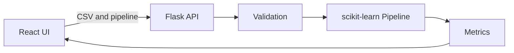

# BioFlow ML — Drag-and-Drop ML Model Builder

BioFlow ML is a no-code web application for building and evaluating classification pipelines. Users upload a CSV file, choose a target column, drag preprocessing and model blocks into a workflow, and train a model through a Flask API.

## Why this project

This project combines full-stack development, machine learning, API design, automated testing, Docker, and health-data analysis. The included sample dataset is based on scikit-learn's Wisconsin breast cancer dataset.

## Features

- Drag-and-drop pipeline builder
- CSV upload and automatic column detection
- Missing-value handling and feature scaling
- Logistic Regression, Random Forest, and K-Nearest Neighbours
- Accuracy, precision, recall, F1 score, and confusion matrix
- Dockerized React and Flask services
- Automated API tests with GitHub Actions
- Input validation and clear error messages

## Architecture



## Quick start with Docker

```bash
docker compose up --build
```

Open `http://localhost:5173`.

## Run locally

### Backend

```bash
cd backend
python -m venv .venv
source .venv/bin/activate
pip install -r requirements.txt
python app.py
```

### Frontend

```bash
cd frontend
npm install
npm run dev
```

## Dataset requirements

- CSV format
- At least two feature columns and one target column
- Target must contain at least two classes
- Numerical and categorical features are supported
- Maximum upload size: 10 MB

Try `sample-data/breast_cancer_sample.csv`, then select `diagnosis` as the target.

## Test

```bash
cd backend
python -m unittest discover -s tests -v
```

## Future improvements

- Regression models
- Model persistence and download
- ROC curves and feature importance
- User accounts and saved experiments
- Genomic VCF input support

## Author

Palak Yadav

